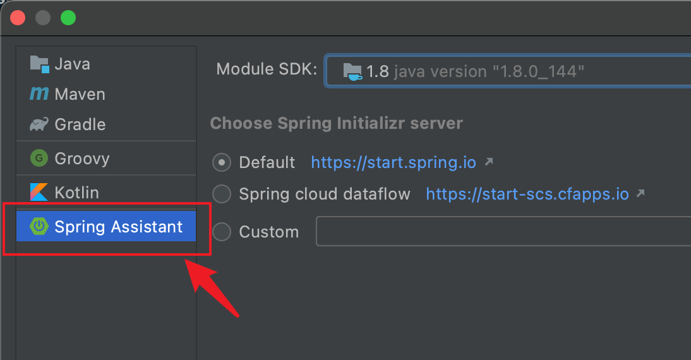
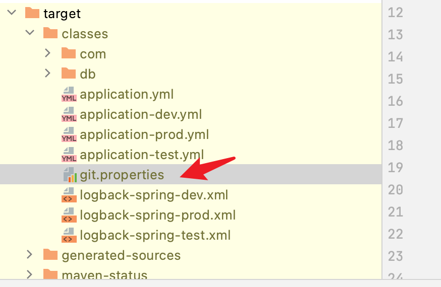
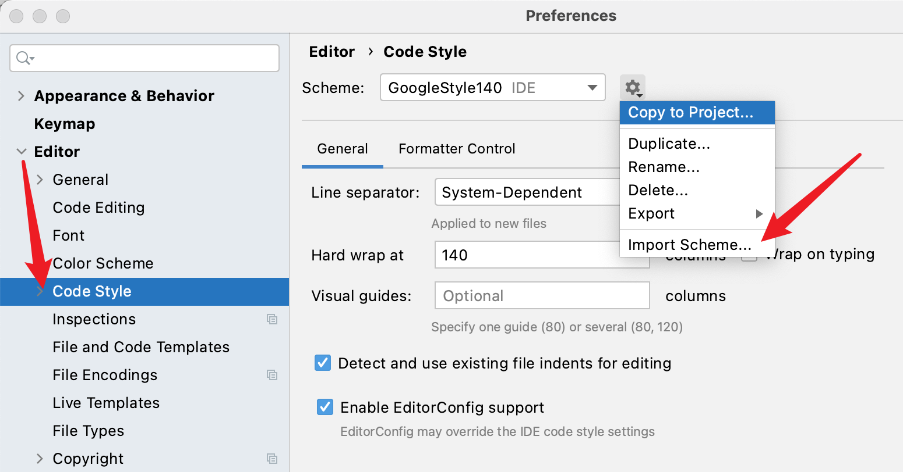

# 创建一个 Spring Boot 单体项目都需要做什么

---

**Table of Contents**

- [创建一个 Spring Boot 单体项目都需要做什么](#创建一个-spring-boot-单体项目都需要做什么)
- [前言](#前言)
- [一、项目搭建](#一项目搭建)
    - [0. 准备工具](#0-准备工具)
    - [1. 选择要用到的依赖](#1-选择要用到的依赖)
    - [2. 配置项目](#2-配置项目)
- [其他配置](#其他配置)
    - [3. 配置跨域](#3-配置跨域)
    - [4. 配置 MyBatis](#4-配置-mybatis)
      - [1. 开始下划线转驼峰](#1-开始下划线转驼峰)
      - [2. 增加分页插件](#2-增加分页插件)
      - [3. 配置 MBG](#3-配置-mbg)
    - [5. 配置 flyway](#5-配置-flyway)
    - [6. 配置 git id 插件](#6-配置-git-id-插件)
    - [7. 配置代码格式](#7-配置代码格式)
    - [8. 编写 Readme](#8-编写-readme)
- [总结](#总结)
- [参考](#参考)

---

# 前言

平常开始新项目的时候，都要从头搭建一个新项目，至于这些模板操作，我们都需要注意什么呢？这里主要介绍一个项目搭建的过程以及一些常用工具和插件的使用。

# 一、项目搭建

### 0. 准备工具

这里使用常见 `IDEA 社区版` 进行操作，以下统称 `IDEA 社区版` 为 `IDEA`.

IDEA 默认为不提供 `Spring Boot` 项目的创建方式的，在这里我们可以通过两种方式创建项目

**一、通过官网进行选择下载后导入到IDEA中**

官网地址是 `https://start.spring.io/`, 如果网络情况不好的情况下，可以使用Alibaba 提供的网站 `https://start.aliyun.com/bootstrap.html`, 其提供了更多的可选项

**二、安装插件**

- Spring Assistant
- Alibaba Cloud Toolkit

如果你对阿里系产品有依赖的话可以安装 `Alibaba Cloud Toolkit`, 其不仅提供了创建Spring Boot 项目的方式，也提供了 Dubbo 的快捷方式，同时还附件一些云产品操作功能，很是方便

这里作者并没有一些阿里云服务的资源和 Dubbo 的使用情况，这里安装了相对轻便的 `Spring Assistant`




到这里，IDEA 社区版就可以便捷的创建项目了

### 1. 选择要用到的依赖

这里考虑到正常工作环境并不会急于升级 `Spring Boot 2.4.0`, 这里使用选用 `Java 8 + Spring Boot 2.3.6 + Maven` 创建项目

创建时选择以下依赖:

依赖 | 作用
:--- |:---
spring-boot-starter-actuator | 提供一些统计端口，如健康检查、info、mapping 等统计信息，配合 `Spring Boot Admin` 使用效果更佳
spring-boot-starter-web | web 项目相关自动配置
spring-boot-starter-data-redis | Spring Data Redis 自动配置，如果不使用，可以移除
mybatis-spring-boot-starter | mybatis 相关配置，不使用可以移除
spring-boot-starter-jdbc | jdbc 相关配置，不使用可以移除
mysql-connector-java | mysql 的jdbc 驱动，可以换成其他的，mysql 使用还是挺广泛的
lombok | 帮助简化一些代码，这个争议还是挺大的，根据团队意见酌情使用

### 2. 配置项目

**1. 根据情况删除不常用的文件或者根本不可能用的文件**

- static 文件夹
- templates 文件夹
- mvnw 文件酌情删除
- 改 properties 为 yml

**2. 增加不同环境的配置文件**

一般都会包括 开发、测试、生产三个配置，有个公司会更多比如预生产、灰度之类的

- application.yml
- application-dev.yml
- application-prod.yml
- application-test.yml

**3. 增加项目配置**

在上面加入了 jdbc、redis 依赖，需要进行一些配置才能正常启动, 这个根据情况配置一下

**4. 增加日志配置**

在项目中配置不同环境的日志输出

> 通过上面的配置，我们的项目就可以启动了，这也可以正常使用了，但这并没有结束

# 其他配置

### 3. 配置跨域

如果项目被前端项目直接访问，还得配置对应的跨域，最省事的方式是实现 `WebMvcConfigurer`

```java
@Configuration
public class WebAppConfig implements WebMvcConfigurer {

  @Override
  public void addCorsMappings(CorsRegistry registry) {
    registry
        .addMapping("/**")
        .allowedOrigins("*") // 这里替换成对应的域名
        .allowCredentials(true)
        .allowedHeaders("*")  // 这里是请求头
        .allowedMethods("*"); // 这里是方法
  }
}
```

更多配置跨域的方式可以参考 [Java 解决跨域问题](./Java%20解决跨域问题.md)

### 4. 配置 MyBatis

在使用 mybatis 时，可以增加一些插件和个性化配置来简化一下操作, 比如启动驼峰转换、增加分页插件和MBG代码生成

#### 1. 开始下划线转驼峰

```yaml
mybatis:
  configuration:
    map-underscore-to-camel-case: true
```

#### 2. 增加分页插件

添加 `PageHelper Spring Boot Starter`

引入依赖

```xml
<dependency>
    <groupId>com.github.pagehelper</groupId>
    <artifactId>pagehelper-spring-boot-starter</artifactId>
    <version>1.3.0</version>
</dependency>
```

在 `application.yml` 增加分页配置

```
pagehelper:
  helper-dialect: mysql
  reasonable: true
  support-methods-arguments: true
  params: count=conutSql
```

#### 3. 配置 MBG

> 官网地址：http://mybatis.org/generator/

**1. 增加插件**

在 `pom.xml` 中配置 `mybatis-generator-maven-plugin`

```xml
<build>
  <plugins>
    <plugin>
      <groupId>org.mybatis.generator</groupId>
      <artifactId>mybatis-generator-maven-plugin</artifactId>
      <version>1.4.0</version>
      <configuration>
        <configurationFile>generatorConfig.xml</configurationFile>
        <verbose>true</verbose>
        <overwrite>true</overwrite>
      </configuration>
    </plugin>
  </plugins>
</build>
```

增加 `generatorConfig.xml` 文件

```xml
<?xml version="1.0" encoding="UTF-8"?>
<!DOCTYPE generatorConfiguration PUBLIC
  "-//mybatis.org//DTD MyBatis Generator Configuration 1.0//EN"
  "http://mybatis.org/dtd/mybatis-generator-config_1_0.dtd">
<generatorConfiguration>

  <classPathEntry location="/Users/zhangyunan/.m2/repository/mysql/mysql-connector-java/5.1.9/mysql-connector-java-5.1.9.jar"/>

  <context id="mysql" targetRuntime="MyBatis3">
    <!-- 这个插件可以方式重新生成 mapper 文件时，采用追加而不是覆盖的问题   -->
    <plugin type="org.mybatis.generator.plugins.UnmergeableXmlMappersPlugin"/>

    <commentGenerator>
      <property name="suppressDate" value="true"/>
      <property name="suppressAllComments" value="true"/>
    </commentGenerator>
    <jdbcConnection
      connectionURL="jdbc:mysql://127.0.0.1:3306/spring-boot-example?characterEncoding=UTF-8&amp;useUnicode=true&amp;serverTimezone=GMT%2B8"
      driverClass="com.mysql.jdbc.Driver"
      password="123456" userId="root"/>

    <javaModelGenerator targetPackage="com.example.structure.infrastructure.entity" targetProject="./src/main/java"/>
    <sqlMapGenerator targetPackage="com.example.structure.infrastructure.mapper" targetProject="./src/main/resources"/>
    <javaClientGenerator targetPackage="com.example.structure.infrastructure.mapper" targetProject="./src/main/java"
      type="XMLMAPPER"/>
    
    <table tableName="sys_dict_type"/>
    <table tableName="sys_dict"/>

  </context>
</generatorConfiguration>
```

在执行之前记得先创建表

```sql
CREATE TABLE `sys_dict_type` (
  `id` int(11) NOT NULL AUTO_INCREMENT,
  `code` varchar(20) NOT NULL COMMENT '编码',
  `name` varchar(20) NOT NULL COMMENT '名称',
  PRIMARY KEY (`id`)
) ENGINE=InnoDB COMMENT='字典类型表';

CREATE TABLE `sys_dict` (
  `id` int(11) NOT NULL AUTO_INCREMENT,
  `type_code` varchar(20) NOT NULL COMMENT '类型code',
  `code` varchar(20) NOT NULL COMMENT 'key',
  `value` varchar(100) NOT NULL COMMENT '值',
  `description` varchar(30) DEFAULT NULL COMMENT '描述',
  `sort` int(11) DEFAULT '0' COMMENT '排序',
  PRIMARY KEY (`id`)
) ENGINE=InnoDB COMMENT='字典表';
```

### 5. 配置 flyway

在开发过程中，不仅在项目创建的时候会创建表或者修改数据库结构，在需求变更、增加时也会不会的修改数据库结构，如果不加以管理的话，会越来越乱，在以往的开发中可能会创建一个叫 `scheam.sql` 的文件, 每次对数据库的修改同时修改这个文件，这种处理方式是可行，但难以追踪和管理，总会有不实时更新文档的情况发生.

这种情况可以通过 `Flyway` 来管理数据库变更情况，使用这个方式保证各个环境的数据库结构一致性 

> 官网介绍为：  
> Version control for your database.
> Robust schema evolution across all your environments.
> With ease, pleasure and plain SQL.

Flyway 提供了 4 种方式使用

1. 命令行工具
2. Java API 调用
3. Maven 插件使用
4. Gradle 插件使用

这里介绍一下 Maven 插件使用

**1. 在 `pom.xml` 加入**

```xml
<plugin>
  <groupId>org.flywaydb</groupId>
  <artifactId>flyway-maven-plugin</artifactId>
  <version>7.2.0</version>
  <configuration>
    <configFiles>
      <configFile>flyway.conf</configFile>
    </configFiles>
  </configuration>
  <dependencies>
    <dependency>
      <groupId>mysql</groupId>
      <artifactId>mysql-connector-java</artifactId>
      <version>5.1.9</version>
    </dependency>
  </dependencies>
</plugin>
```

**2. 在项目里面创建 `flyway.conf` 文件**

```
flyway.url=jdbc:mysql://127.0.0.1:3306/spring-boot-example
flyway.user=root
flyway.password=123456
```

在不同环境执行时，可以通过 `-Dflyway.configFiles` 来指定配置文件来区分测试环境、生产环境

```s
mvn -Dflyway.configFiles=xxx.conf flyway:migrate
```

**3. 创建sql 文件**

在 resources 下创建 `db/migration` 文件夹, 在这里面就是我们要写的 DDL SQL 文件

> 更多操作见Flyway 官网: https://flywaydb.org/

### 6. 配置 git id 插件

在开发中，可能会出现测试环境发布的版本和自己通过 CI/CD 平台发布的版本不一致的情况，或者明明改了代码，为什么测试/线上没有生效呢？这是我们可以使用 `git id` 插件，帮我们查看部署的项目的版本信息

在 `pom.xml` 加入
```xml
<plugin>
  <groupId>pl.project13.maven</groupId>
  <artifactId>git-commit-id-plugin</artifactId>
  <version>4.0.3</version>
  <executions>
    <execution>
      <goals>
        <goal>revision</goal>
      </goals>
    </execution>
  </executions>
  <configuration>
    <dotGitDirectory>${project.basedir}/.git</dotGitDirectory>
  </configuration>
</plugin>
```

这样编译和打包的文件中会生成一个 `git.properties` 文件，这样可以通过解压jar包的方式查看这个文件



不过通过解压 jar 包的方式还是有点 low 的，因为上面加入了 `spring-boot-starter-actuator` 可以通过 `actuator/info` 方式来查看 `git.properties` 信息

在 `application.yml` 加入

```
info:
  version: 0.0.1
  description: 项目搭建版本
```

启动项目并访问 `actuator/info`

则可看到如下信息，这样就可以检查项目运行的分支和具体的 commit id

```json
{
  "version": "0.0.1",
  "description": "项目搭建版本",
  "git": {
    "commit": {
      "time": "2020-11-15T07:59:05Z",
      "id": "b36f324"
    },
    "branch": "main"
  }
}

```

如果想查看 git 的更多信息，需要加入修改配置

```yaml
management:
  info:
    git:
      mode: full
```

> 使用IDEA直接启动的项目的时候要保证target文件下已经生成了 `git.properties`, 如果没有，可以执行 `mvn complie` 再运行或者使用 `mvn spring-boot:run` 运行. 这个问题是 IDEA 的问题

### 7. 配置代码格式

在团队开发中，如果每人都有自己代码风格，这样写出来的代码是不统一，甚至同一个文件多个人修改时容易反生上头的感觉

这里可以一个统一的代码风格文件，并导入IDEA, 这样大家格式化化的风格就会一致

导入方式为 



样例文件可以参考 https://github.com/zhangyunan1994/code-template/tree/master/template/styleguide 中 intellij-java-google-style.xml

### 8. 编写 Readme

写个关于模板项目使用的一些情况，方便其他同时可以快速复制项目进行修改

# 总结

项目代码地址为: https://github.com/zhangyunan1994/spring-boot-example

# 参考

1. http://mybatis.org/generator/
2. https://flywaydb.org/