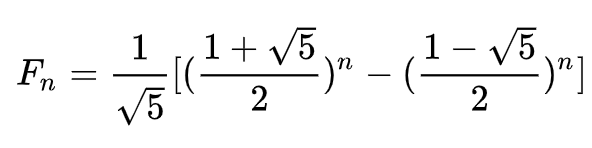

# 斐波那契数

斐波那契数，通常用 F(n) 表示，形成的序列称为斐波那契数列。该数列由 0 和 1 开始，后面的每一项数字都是前面两项数字的和。也就是：

    F(0) = 0,   F(1) = 1
    F(N) = F(N - 1) + F(N - 2), 其中 N > 1.

给定 N，计算 F(N)。

# 具体实现

### 循环法

```c++
#include <iostream>

using namespace std;

int fib(int N) {
    if(N < 2) {
        return N;
    }
    if(N == 2) {
        return 1;
    }
    int a = 0, b = 1, result=0;
    for(int i=2; i<=N; ++i) {
        result = a + b;
        a = b;
        b = result;
    }
    return result;
}
```

### 递归法

```c++
int fibRecursion(int N) {
    if (N < 2) {
        return N;
    } else if (N == 2) {
        return 1;
    } else {
        return fibRecursion(N - 1) + fibRecursion(N-2);
    }
}
```

### Go 语言循环实现

> 其实循环的方法是一样的，不过 `Go`、`Python` 有个更好的赋值用法，所以单独写一下

```go
func Fib(N int) int {
	if N < 2 {
		return N
	}
	if N == 2 {
		return 1
	}
	var a = 0
	var b = 1
	for i := 2; i <= N; i++ {
		a, b = b, a+b
	}
	return b
}
```

### 使用数据公式计算

