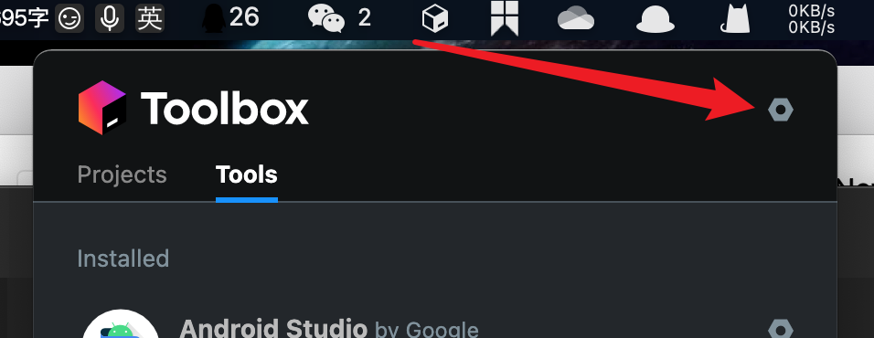
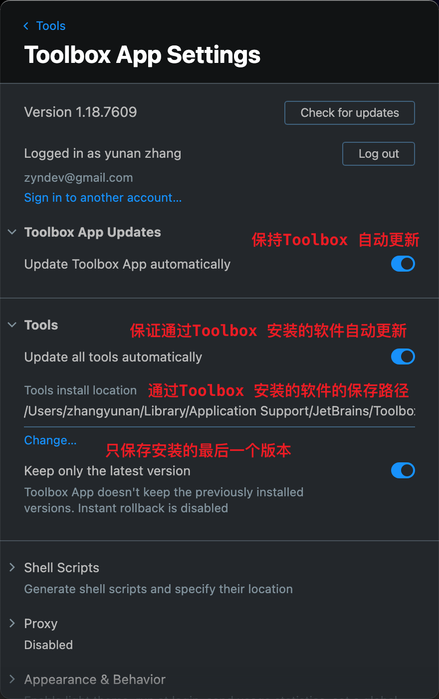
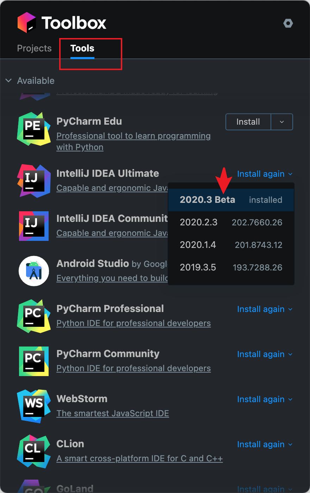
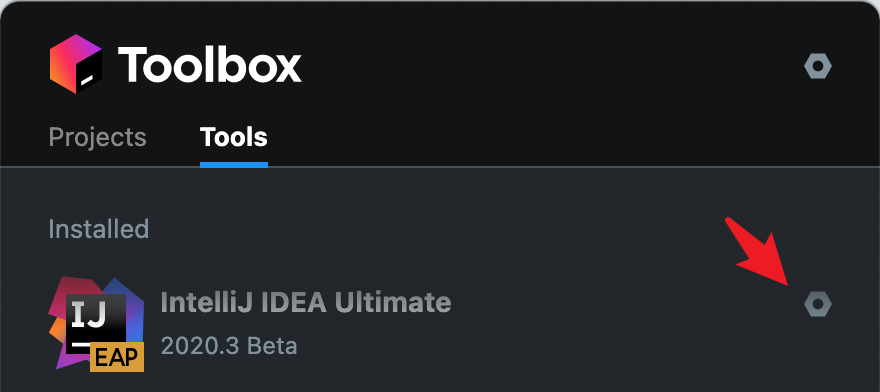
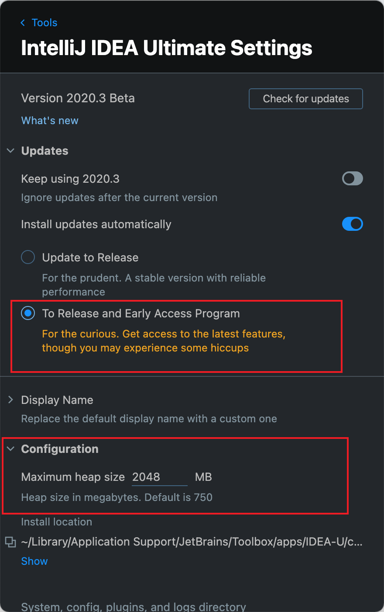
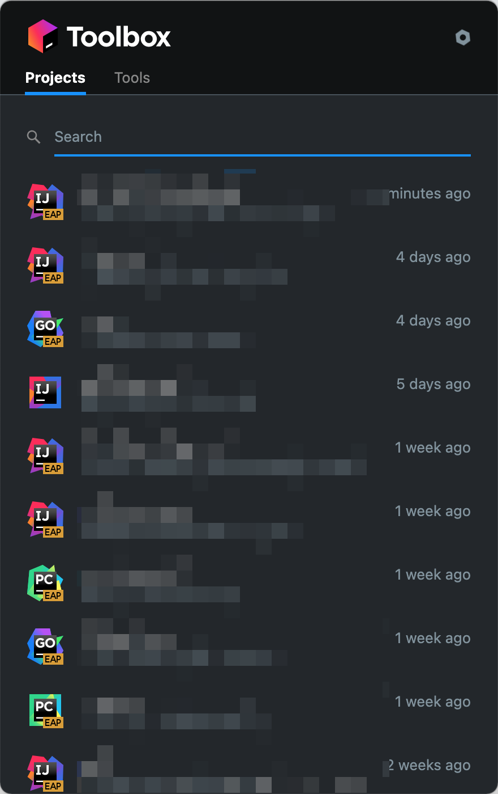

# 听说你还在找 IDEA (JetBrains) 激活码, 试试她吧

# 系列文章目录

第一篇: 听说你还在找 IDEA (jetbrains) 激活码, 试试她吧

---

- [听说你还在找 IDEA (JetBrains) 激活码, 试试她吧](#听说你还在找-idea-jetbrains-激活码-试试她吧)
- [系列文章目录](#系列文章目录)
- [前言](#前言)
- [一、什么是EAP版本？](#一什么是eap版本)
- [二、如何安装](#二如何安装)
  - [安装方式](#安装方式)
  - [使用 Toolbox 来安装EAP](#使用-toolbox-来安装eap)
    - [1. 安装 Toolbox](#1-安装-toolbox)
    - [2. 配置 Toolbox](#2-配置-toolbox)
    - [3. 安装 IDEA EAP](#3-安装-idea-eap)
    - [4. 其他功能](#4-其他功能)
- [总结](#总结)

---

# 前言

**JetBrains** 系列软件一直深受开软人员喜爱，但其定价也属实劝退了一大部分人. 要使用这些软件有几种方法

- 使用社区版: 这里有 IDEA、PyCharm 都提供了社区版可以使用，在功能能能满足大部分需求
- 教育邮箱: 使用教育邮箱可以免费使用 **JetBrains**，但不得用于商业用途
- 使用 EAP 版本软件
- 某宝找破解方法
- 网站找激活码、网站、工具激活

对于正常使用社区版可以满足基本需求，但一些好用的功能，在社区版没有的. 比如：
- spring 全系校验和提示支持
- go 校验和提示支持
- flask、Django 校验和提示支持

等等

这里主要介绍通过 EAP 版本，来使用这些功能

# 一、什么是EAP版本？

The Early Access Program

The Early Access Program (EAP) provides free access to pre-release builds of our products: you can try our new features out early in return for your valuable feedback.

这是一个 JetBrains 产品的正式发布前预览版本，这个版本可以体验一些新功能

# 二、如何安装

## 安装方式

官网提供两种安装方式

**1. 从官网下载**

https://www.jetbrains.com/resources/eap/

**2. 使用 Toolbox 安装**

## 使用 Toolbox 来安装EAP

### 1. 安装 Toolbox

在官网下载并安装 `Toolbox`

https://www.jetbrains.com/toolbox-app/

安装并运行后，
- Windows 在右下角`系统托盘`
- Mac 在 `菜单栏` 可以找到，如果找不到可能是没有启动或者`菜单栏`显示不全导致的

### 2. 配置 Toolbox

在 Mac 上点菜单栏的 `Toolbox(立方体)` 图标，即可点开，然后点击 `螺母(设置)`

在使用之前进行一些配置

- 保持 Toolbox 本身自动更新
- 保持通过 Toolbox 安装的软件自动更新
- 修改软件安装路径
- 只保存安装的最后一个版本

`只保存安装的最后一个版本` 这个是挺重要的，如果同一个软件（比如IDEA）安装了多个版本，Toolbox 默认不会覆盖安装，而是保留多个版本，这样会造成磁盘占用越来多大

`保持通过 Toolbox 安装的软件自动更新` 因为要安装的本身是 `EAP` 版本所以要保证能及时的得到官方的最新版本，同时因为 `EAP` 版本的有效期是一个月(从构建这个版本开始算起)， 通过自动更新相对于在续命

### 3. 安装 IDEA EAP

配置完成后, 在 Tools 选项卡里面找到想安装的软件，选择包含 `Beta` 或者 `EAP` 的版本安装即可

安装完成后，在 Tools > Available 即可看到已经安装成功的 `IDEA EAP`, 这里在进行一些其他的配置

在这里可以设置优先使用 EAP 版本更新，同时根据情况设置下最大内存，默认是 750，设的大点会提高 `IDEA` 流程性，当然不是越大越好，这个需要自己调一下试试 

> 同理可以安装其他软件

### 4. 其他功能

Toolbox 还会在 Projects 上展示创建的项目，可以快速查询和打开

# 总结

这里可能应该有点啥，但我不知道些什么了