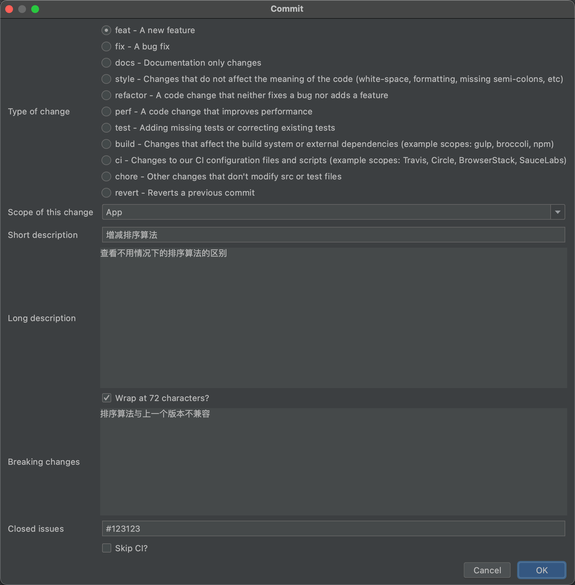

# 代码审核规范

该规范主要参考《谷歌的代码评审指南》


# 一、开发者

1. 不应该在 CI 内同时包含主要风格的改动与其他代码的修改，这样会导致难以看出 CI 到底做出什么改动

2. 格式化 commit message

优势：

1. 提供更多的历史信息，方便快速浏览;
2. 可以过滤某些 commit（比如文档改动），便于查找信息;
3. 可以直接从 commit 生成 change log。

格式：

commit message 都包含三个部分：Header（必需）、Body（可选）、Footer（可选）

```
<type>(<scope>): <subject>
<BLANK LINE>
<body>
<BLANK LINE>
<footer>
```


Header 部分只有一行，三个字段：type（必需）、scope（可选）、subject（必需）

**type** 用于说明commit的类别，只允许使用下面7个标识

- feat：新功能（feature）
- fix：修复bug
- docs：文档
- style：格式（不影响代码运行的变动）
- refactor：重构（既不是新增功能，也不是修改bug的代码变动）
- perf：提高性能的改动，不改变逻辑
- test：增加测试
- build：构造工具的或者外部依赖的改动
- ci：改变关于 ci 的配置、脚本或者依赖
- chore：构建过程或辅助工具的变更
- revert：回退上一个版本

**scope** 用户说明 commit 影响的范围，比如数据层、控制层、视图层等
**subject** 是 commit 目的的简短描述，不超过50个字符

**body** 部分是对本次 commit 的详细描述，可以分成多行

**footer** 部分只用于两种情况：1、不兼容变动；2、关闭issue


> 扩展：如果你使用 IDEA 进行编码，可以是使用 `git commit template` 插件来规范每次提交的 commit message 信息



格式化后的代码 message 为：

```
feat(App): 增减排序算法

查看不用情况下的排序算法的区别

BREAKING CHANGE: 排序算法与上一个版本不兼容

Closes #123123
```


# 二、评审者

checklist

- 设计：代码是否经过精心设计并适合你的系统
- 功能：代码是否符合开发者意图？
- 复杂性：代码是否可以更简洁？未来其他开发者接手时，代码是否易于理解与易用？
- 测试：代码是否经过正确且设计良好的自动化测试
- 命名：开发人员是否为变量、类、方法等选择了明确的名称？
- 注释：注释是否清晰有效？
- 风格：代码是否遵循了代码开发规范
- 文档：开发人员是否也同步更新了相关文档

1. 在评论前加上“nit:”这样的前缀，表明这是一个优化性的建议，可以不影响本次上线
2. 应在一个工作日内完成评审，并给出意见
3. 评价只针对代码和具体业务流程


# 三、小项目团队内部采用轮换review的方式

通过团队内部轮流review来帮助团队成员对项目整体流程和代码的认知，通过一次一次review来提高每个成员对整个项目的大体流程、细节的熟悉程度，减少因为不熟悉代码导致的重复逻辑开发，减少写重复代码的概率。

通过审核别人的代码，也能发现一些自己的一些缺点，有则改之，无则加勉。


