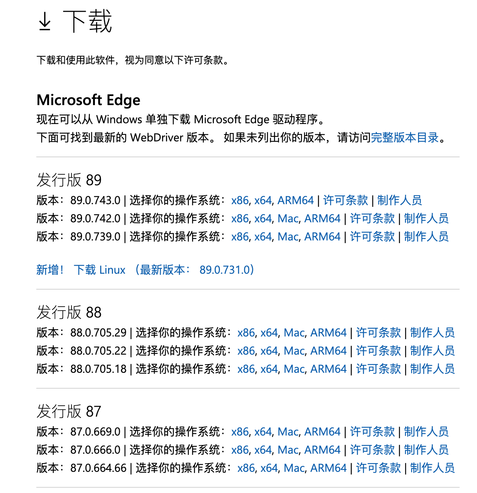

<h1>Selenium 初体验</h1>

---
**Table of Contents**

- [简介和准备环境](#简介和准备环境)
  - [简介](#简介)
  - [环境](#环境)
- [网站常用操作](#网站常用操作)
  - [Selenium功能](#selenium功能)
  - [测试常用操作](#测试常用操作)
- [Selenium实现](#selenium实现)
  - [下载 WebDriver](#下载-webdriver)
  - [打开浏览器](#打开浏览器)
  - [输入内容](#输入内容)
  - [单击操作](#单击操作)
  - [获取当前浏览器的 url](#获取当前浏览器的-url)
  - [来点小操作](#来点小操作)
  - [上传图片](#上传图片)

---

> 每一段旅程，都有风景.

从 17 年开始接触 `selenium` , 突然想写一篇，在此总结一下使用的经验

# 简介和准备环境

## 简介

Selenium 是专门为 Web 应用程序编写的一个验收测试工具。Selenium 测试直接运行在浏览器中，支持的浏览器包括IE、Chrome、Microsoft Edge、Mozilla Firefox、Mozilla Suite等。

主要功能包括：测试与浏览器的兼容性——测试你的应用程序看是否能够很好得工作在不同浏览器和操作系统之上。


对于一些复杂的网站，同样可以使用它进行爬取。

## 环境

这里使用的 `python` 进行开发

- Python 3.9
- Webdriver
- Selenium
- Microsoft Edge

其中 Webdriver 需要根据不同的浏览器版本和操作系统下载对应版本

- Microsoft Edge 下载地址[https://developer.microsoft.com/zh-cn/microsoft-edge/tools/webdriver/#downloads]

selenium 可以使用 `pip install selenium` 安装

# 网站常用操作

## Selenium功能

框架底层使用 JavaScript 模拟真实用户对浏览器进行操作。测试脚本执行时，浏览器自动按照脚本代码做出点击，输入，打开，验证等操作，就像真实用户所做的一样，从终端用户的角度测试应用程序。

使浏览器兼容性测试自动化成为可能，尽管在不同的浏览器上依然有细微的差别。

使用简单，可使用 Java、Python 等多种语言编写用例脚本

## 测试常用操作

在日常测试时，我们经常会遇到以下操作：

- 单击
- 输入文字(数字等)
- 上传图片
- 选择(单选，多选等)

以上为常用操作，那以这些常用操作来开始以下叙述

# Selenium实现

## 下载 WebDriver

Webdriver 需要根据不同的浏览器版本和操作系统下载对应版本

- **Microsoft Edge** https://developer.microsoft.com/zh-cn/microsoft-edge/tools/webdriver/#downloads
- **Chrome** http://chromedriver.storage.googleapis.com/index.html 备用地址 http://npm.taobao.org/mirrors/chromedriver
- **Firefox** https://github.com/mozilla/geckodriver/releases

从下载地址可以看出 Microsoft Edge 更加友好些，可以根据不同的版本和平台下载对应的版本



## 打开浏览器

测试肯定需要打开浏览器了，这里以 `Chrome` 为例

```python
from selenium import webdriver


browser = webdriver.Chrome(CHROME_DRIVER_PATH)
```

这样就可以初始化一个浏览器，这里打开`https://github.com/login`,

```python
browser.get('https://github.com/login')
```
这样就打开了github登录页面

## 输入内容

登录之后我们可以看到，账号和密码的输入框，这时我们输入账号和密码

```python
account_input = browser.find_element(By.CSS_SELECTOR, '#login_field')
account_input.clear()
account_input.send_keys('zyndev@gmail.com')

password_input = browser.find_element_by_css_selector('#password')
password_input.click()
password_input.send_keys('********')
```

首先使用 `find_element` 找到对应的元素，这里可以使用 `xpath`,`class name`,`css selector`,`id` 等方式进行定位

定位得到账号输入框元素，先清空原来的内容，后通过 `send_keys` 输入账号，

同时输入密码，在输入密码时使用 `find_element_by_css_selector` 方法，这样就不用指定使用什么选择器了

## 单击操作

一般网页中会包含 **按钮**、**选项卡**、**菜单**、**链接** 等点击操作

对应的 selenium 提供了
在上一步中，我们输入了账号和密码，这是需要单击一下登录按钮，来完成登录

```python
login_button = browser.find_element_by_css_selector('.btn')
login_button.click()
```

与输入内容相比，这里需要调用 `click` 来完成单击操作

## 获取当前浏览器的 url

当我们单击登录时，如果登录成功会跳转到 `https://github.com/`而不是继续留在`https://github.com/login`,

可以通过 `current_url` 来获取当前的url

```python
print(browser.current_url)
if 'https://github.com/' == browser.current_url:
    print('login success')
```

**通过 `get`,`find_element`,`find_element_by_css_selector`,`clear`,`send_keys`, `click`,`current_url` 等方法我们已经可以实现简单的登录操作**

## 来点小操作

在平常测试我们经常需要修改一些数据，当登录成功时，点击头像后出现一个浮层，上面有`setting`，那我们用上面的代码如何点击呢？


```python
summary_button = browser.find_element_by_css_selector('#user-links > li:nth-child(3) > details > summary')
summary_button.click()

time.sleep(0.5)

setting_button = browser.find_element_by_css_selector('#user-links > li:nth-child(3) > details > ul > li:nth-child(8) > a')
setting_button.click()
```
这里加入了 `time.sleep(0.5)` 防止单击过快导致浮层还没有显示出来造成 `setting_button` 获取失败 


## 上传图片

在上面的设置中，我们看一下如何上传图片

```python
file_button = browser.find_element_by_css_selector('#upload-profile-picture')
file_button.send_keys('/Users/zhangyunan/Downloads/2234.jpg')
```
这样简单的上传图片功能就完成了

> 这里总结一下，今天就到这里了
完整代码

```python
from selenium import webdriver
from selenium.webdriver.common.by import By
import time


browser = None

def init_chrome():
    global browser
    browser = webdriver.Chrome('/Users/zhangyunan/Downloads/chromedriver')

def login():
    browser.get('https://github.com/login')
    account_input = browser.find_element(By.CSS_SELECTOR, '#login_field')
    account_input.send_keys('zyndev@gmail.com')
    password_input = browser.find_element_by_css_selector('#password')
    password_input.send_keys('password')
    login_button = browser.find_element_by_css_selector('.btn')
    login_button.click()
    time.sleep(2)
    return 'https://github.com/' == browser.current_url

def modify_profile():
    summary_button = browser.find_element_by_css_selector('#user-links > li:nth-child(3) > details > summary')
    summary_button.click()
    time.sleep(0.5)
    setting_button = browser.find_element_by_css_selector(
        '#user-links > li:nth-child(3) > details > ul > li:nth-child(8) > a')
    setting_button.click()
    time.sleep(0.5)

    file_button = browser.find_element_by_css_selector('#upload-profile-picture')
    file_button.send_keys('/Users/zhangyunan/Downloads/2234.jpg')

def quit_browser():
    browser.quit()

if __name__ == '__main__':
    init_chrome()
    if login():
        modify_profile()
        time.sleep(10)
        quit_browser()
    else:
        print('login fail')

```

> 谢谢阅读
