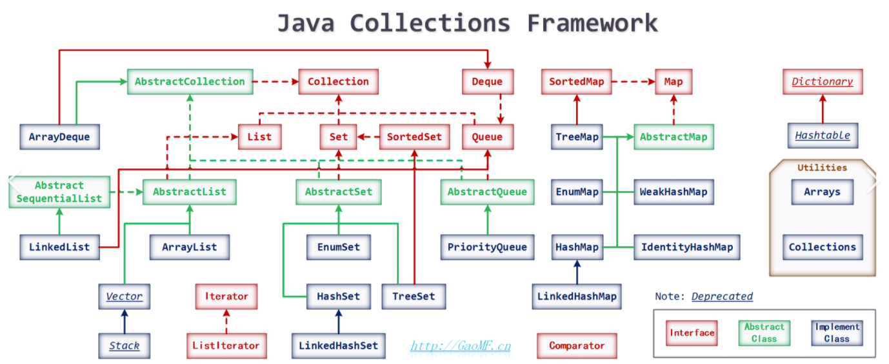
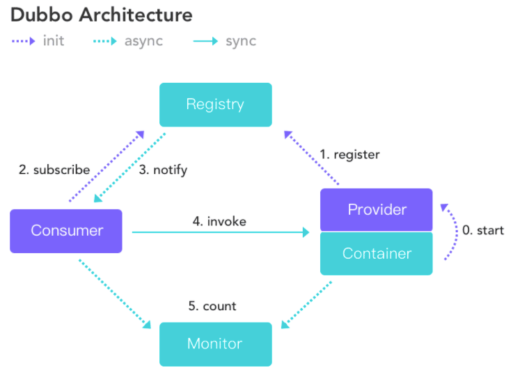

# 阿里面试

## 1. 自我介绍 说一下主要干啥

## 2. 微服务化了一个请求过来都是在处理的

1. （如果有）首先请求到了需要过四层负载，来确定域名最终请求的服务器
2. （如果有）如果上面的服务器安装了七层负载（例如 Nginx）则根据对应规则转发请求到目标服务器
3. 请求到微服务的网关中 (zuul 或者 spring cloud gateway), 根据对应的规则找到需要请求的服务名
4. 找到服务名之后根据服务发现和负载均衡找到对应的服务处理，例如服务A
5. 如果服务A 中还调用了其他服务，例如服务B，则继续根据服务名采用服务发现和负载均衡找到对应的服务处理，直到最终处理完

## 3. 网关是咋走的

Spring Cloud Gateway

1. 接收请求
2. 根据断言找到对应的 host，可能是简单的 host，也可能是 lb, 或者 weight
3. 根据新的 host，使用 httpclient 发送到目标服务器
4. 将新的影响放入 exchange 中
5. 最后通过过滤器将响应处理

## 4. DDD 说一下

## 5. 为啥要微服务项目

在互联网项目中，往往信奉「 变化是常态，唯一不变的就是变化 」。在项目的进展中往往也是这样的，某个功能或者项目可能一改再改到面目全非都有可能。

在传统的单体项目中，当项目做到一个规模后，往往会遇到以下的问题：

- 代码量大，导致编译时间长，启动时间长，占用内存大，甚至导入 IDE，电脑瞬间就开始呼呼的抱怨了
- 代码改动之后影响范围未知，测试难度大
- 每增加或者改动一个功能后，都需要部署整个项目
- 所有的功能都在一个项目里面，导致人员认知、容灾的成本增加
- 无法灵活的采用新的技术栈或者更新一些依赖的版本

为了解决这一些问题，微服务成了单体项目无法支撑之后的一个选项

**微服务架构其实就是一种架构风格**，我们将整个项目划分为多个独立的小项目，也就是我们俗称的微服务，但是微服务的 “’微” 并没有明确的定义，可以理解为每个微服务都单独处理某个功能模块，可以独立开发、测试、部署、监控和扩展，甚至可以用不同的编程语言开发它们。它有利于我们平时项目的开发，解决了一体化架构项目难以扩展，开发周期长，故障级联等问题。

## 6. JVM内存说一下
1. 堆（heap)
2. 程序计数器（PC Register）
3. 虚拟机栈（JVM Stack)
4. 本地方法栈（Native Stack)
5. 元空间（MetaSpace）: 原方法区

## 7. 类加载有几种

类加载分为动态加载和静态加载。动态加载是从外存储器中加载类，一般类加载机制分析的也是动态加载。而静态加载本质上是从内存中创建类的实例对象，此时类已经被加载到内存中。

**第一种：** 通过new关键字来创建实例对象。

**第二种：** 通过Class.forName()来加载类，然后调用类的newInstance()方法实例化对象。

**第三种：** 通过类加载器的loadClass()方法来加载类，然后调用类的newInstance()方法实例化对象。

这里有几个需要比较的地方：

1.通过new关键字实例化类的对象和通过Class.forName()加载类是当前类加载器，即this.getClass.getClassLoader，只能在当前类路径或者导入的类路径下寻找类。而用指定的classLoader来加载类可以从当前路径外寻找类，这里的classLoader甚至可以用户自定义。

2.我们知道类加载机制的三个过程主要是加载-->连接-->初始化。Class.forName()实际调用的是Class.forName(className,true,this.getClass.getClassLoader)，第二个参数表示加载完后是否立即初始化，第三个参数即前文提到的表示是当前类加载器。classLoader.loadClass()实际调用的是classLoader.loadClass(className,false)，第二个参数表示加载完成后是否连接，即用此方法加载类，加载完成后不会去初始化，而用Class.forName()加载类加载完成后可以被初始化。所以有些类如果加载完成后需要立即被初始化则必须使用Class.forName()。例如在加载数据库驱动时，一般用Class.forName("com.mysql.jdbc.Driver")。这是因为该驱动有一个在静态代码块中注册驱动的过程，所以需要被初始化。

3.有两个异常

静态加载类时出现的一般是NoClassDefFoundError。

动态加载类时出现的一般是ClassNotFoundException。

这两者经常被用来比较，其实区别很大。NoClassDefFoundError是错误，不方便被捕捉也不需要被捕捉，不应该尝试从error中恢复程序。他是由于在使用new关键字实例化类的对象时，在内存中找不到对象了，一般比较少见，在运行时发生，即编译时可以找到类运行时却找不到了。而ClassNotFoundException是异常，是可以被捕捉的，应该捕捉并处理尝试恢复程序。这是由于利用类名动态加载类的时候，在外存储器类路径下找不到该类或者其依赖的jar包，还有一个导致其的原因是在同一个包中同一个类被不同的类加载器加载了两遍。

**其中类加载器有可以分为以下 4 种：**

1. 启动类加载器（Bootstrap ClassLoader）用来加载java核心类库，无法被java程序直接引用。
1. 扩展类加载器（extensions class loader）：它用来加载Java的扩展库。Java虚拟机的实现会提供一个扩展库目录。
该类加载器在此目录里面查找并加载 Java类。
1. 系统类加载器（system class loader）也叫应用类加载器：它根据Java应用的类路径（CLASSPATH）来加载Java类。一般来说，Java应用的类都是由它来完成加载的。可以通过ClassLoader.getSystemClassLoader0来获取它。
1. 用户自定义类加载器，通过继承 java.lang.ClassLoader类的方式实现。
   

## 8. 数组 链表 map 说说

数组：定长，空间连续，随机访问

链表：不定长，可自动扩容

Map：kv 结构

## 9. dubbo 说说原理

一、Duboo基本概念解释

Dubbo是一种分布式服务框架。 Webservice也是一种服务框架，但是webservice并不是分布式的服务框架，他需要结合F5实现负载均衡。因此，dubbo除了可以提供服务之外，还可以实现软负载均衡。它还提供了两个功能Monitor 监控中心和调用中心。这两个是可选的，需要单独配置。

Dubbo的计数架构图如下：

我们解释以下这个架构图：

Consumer 服务消费者，Provider 服务提供者。Container 服务容器。消费当然是 invoke 提供者了，invoke 这条实线按照图上的说明当然同步的意思了，多说一句，在实际调用过程中，Provider 的位置对于 Consumer 来说是透明的，上一次调用服务的位置（IP地址）和下一次调用服务的位置，是不确定的。这个地方就是实现了软负载。

服务提供者先启动start，然后注册 register 服务。

消费订阅 subscribe 服务，如果没有订阅到自己想获得的服务，它会不断的尝试订阅。新的服务注册到注册中心以后，注册中心会将这些服务通过 notify 到消费者。

Monitor 这是一个监控，图中虚线表明 Consumer 和 Provider 通过异步的方式发送消息至 Monitor，Consumer 和 Provider 会将信息存放在本地磁盘，平均 1min 会发送一次信息。Monitor 在整个架构中是可选的（图中的虚线并不是可选的意思），Monitor 功能需要单独配置，不配置或者配置以后，Monitor 挂掉并不会影响服务的调用。

# 参考

https://blog.csdn.net/weixin_42447959/article/details/81255112