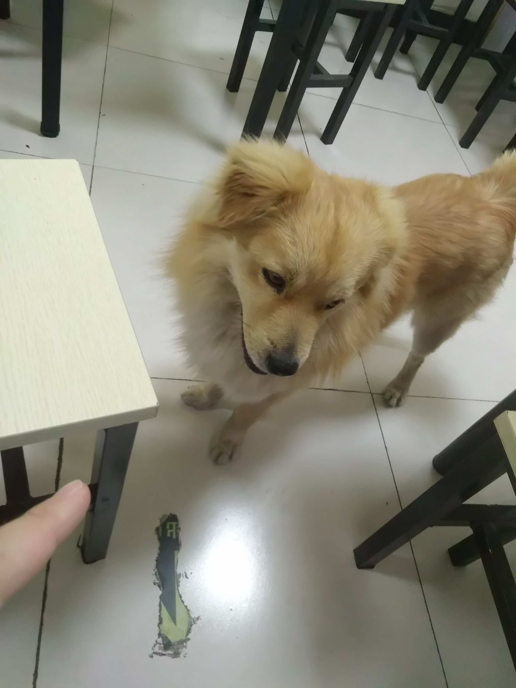

# 第十二夜 我的故事一直有你们

> 本文纯属巧合，如有雷同，纯属虚构，部分事实为了虚构需要而被扭曲

故事从 2018年10月开始，当时刚刚从上海访友回来，不得不说上海外院的猫还是挺漂亮的，在外院待了一天的时间，在酒店待了几天，虽然没有什么意外，但总体来说那几天还挺顺利，只是最后...

从上海回来也休息够了，开始找下一份工作，当时住在西城区，为了上班方便，开始找附近的公司，当然也找了几家，其实都还好，不过最后为了方便找了家交通相对方便的，这样坐地铁方便点，最后证明是我想多了，自从上班之后，就没怎么做过地铁，一直是在跑步、骑自行车、骑电动车之间转换，导致我现在做地铁经常坐反，当然这是后话了。

我是 11 月开始入职的，当时快年底了，本来这个时间应该是公司最清闲的时候，而我刚好入了一个大坑，刚刚入职两个星期的我，业务都不了解，就要进行项目改版，当时每天都要改 Bug 到 9 点左右，因为当时每次改动都需要同事审核和测试发版，这样我的奇怪的工作量增加了，每改一次都需要找同事让他审核下，然后再去找测试小姐姐发下环境，周而复始也慢慢的熟络起来。在这期间每天晚上 9 点被 2 个测试小姐姐带着去地铁站，然后发现还顺路，还发现我们都是邯郸老乡（我其实是廊坊的，不过我的手机号一直是邯郸的，好多人都认为我是邯郸本地的）。

原本 965 的工作制，被我生生的升级到了 995，我想她们应该都知道我上班是在写 Bug 吧！这样的日子持续了将近一个月，也算是终于结束。这块工作的结束了，其中一个测试小姐姐为了提升自己、身兼数职、不断拓展新的业务能力、不断挑战自己的极限（总之就是特别棒）自愿被迫去另一个业务线了，迎来她的变成了不间断的 996 和不停的据理力争！

过了一个月也就到了年底了，本以为可以轻松的过一下春节的前夕，但更麻烦的开始了，这次要和其他业务线的一起写支付逻辑了，做在我对面的大侠负责和我联调，别人都叫他大侠，他自己也有个武侠梦，现在已经很久没联系到他了，或许他已经走上了大侠的道侣吧！

每天和东远他们去小胡同里面吃饭，原来他们是四人帮的，加上我之后就变成了五人，一桌是再也坐不下了。

如果说这是东远你可能不信，但是谁又会不信呢？这也算是眉清目秀的，小鼻子很黑、毛色不错说明很健康，也不怎么嘤嘤。后来和老铁以及其他人多方考证，确实是他本人无疑，这样给我们也减少了很多烦恼，毕竟他不用上桌子吃饭了，剩下的我们四个就刚刚好了。

 

不过作为一个程序员

被两个大汉监督下写代码是什么一样的体验

那被四个不太彪的小汉看着我想压力也不小吧！

祝大家未来可期

> 大部分 90 后程序员并不穿格子衫

